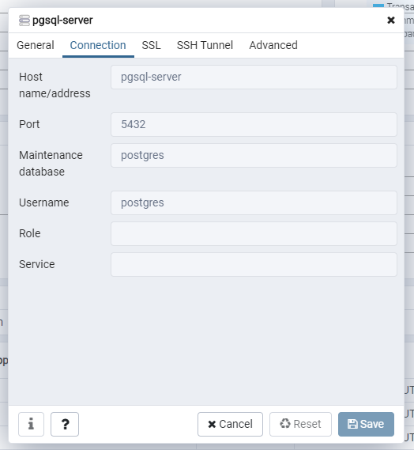

# Docker compose for PostgreSQL and pgAdmin
## Introduction  
PostGIS enabled PostgreSQL, plus pgAdmin.  
Following extensions are configured:  
- postgis
- postgis_topology
- fuzzystrmatch
- postgis_tiger_geocoder
See [docker-postgis](https://github.com/postgis/docker-postgis) for further details.

## Configuration
Configuration can be obtained by editing files in `secrets` folder. 
### PostgreSQL
- PostgreSQL default database: `secrets/postgres_db`
- PostgreSQL username: `secrets/postgres_user`
- PostgreSQL password: `secrets/postgres_password`

### pgAdmin
- `PGADMIN_DEFAULT_EMAIL: admin@linuxhint.com`  
- `PGADMIN_DEFAULT_PASSWORD: secret`  

PostgreSQL service is reachable from pgAdmin interface as `pgsql-server` 



## Deplyment steps
### Deploy services
```
docker-compose up -d
```
### Shut down services
```
docker-compose down
```

## Adding a new Database
Extension are installed and enabled for firstly created dataset, specified in `secrets/postgres_db`. When a new dataset is created, you can enable the extensions by using following query:
```SQL
CREATE EXTENSION IF NOT EXISTS postgis;
CREATE EXTENSION IF NOT EXISTS postgis_topology;
CREATE EXTENSION IF NOT EXISTS postgis_tiger_geocoder CASCADE;
```